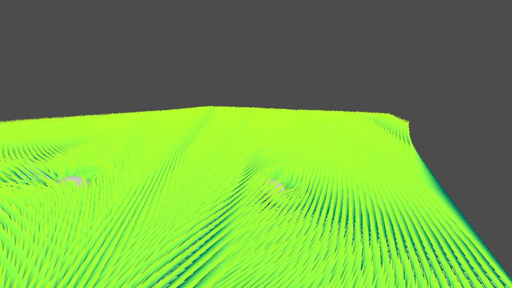

# Godot MultiInstancing \& GrassShader

A demo scene displaying both multi-instancing and grass shader. Move camera with WASD and rotate camera by holding down right mouse button.

Features of the multi-instancing:

* instantiates meshes batching them together.
* instantiates meshes on given terrain at each vertex

Features of the shader:

* Basic coloring without texture.
* Interactable by multiple objects simultaneously. Interactable objects need to be passed to the grass shader. Shader need to be updated based on expected maximum expected interactable objects before run time.
* Wind sway with given direction
* Wind sway patterns with noise texture
* Rotates meshes towards camera view. Expecting billboard meshes.

